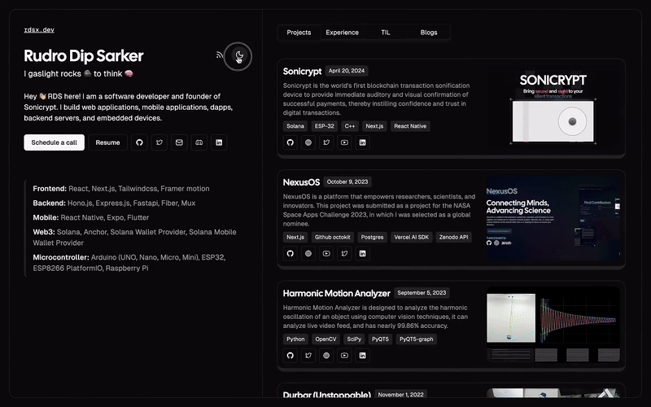

# Theme toggle effect

Here's how we can create theme toggle effect using view transitions api

This is literally the two lines of js you need

```js
if (!document.startViewTransition) switchTheme()
document.startViewTransition(switchTheme);
```

Then you can write your css as you wish to

For example

```css
::view-transition-group(root) {
  animation-timing-function: var(--expo-out);
}

::view-transition-new(root) {
  mask: url('data:image/svg+xml,<svg xmlns="http://www.w3.org/2000/svg" viewBox="0 0 40 40"><defs><filter id="blur"><feGaussianBlur stdDeviation="2"/></filter></defs><circle cx="20" cy="20" r="18" fill="white" filter="url(%23blur)"/></svg>') center / 0 no-repeat;
  animation: scale 1s;
}

::view-transition-old(root),
.dark::view-transition-old(root) {
  animation: none;
  z-index: -1;
}
.dark::view-transition-new(root) {
  animation: scale 1s;
}

@keyframes scale {
  to {
    mask-size: 200vmax;
  }
}
```

This will create a nice circular transition effect when you switch themes.


For more examples, visit [theme-toggle.rdsx.dev](https://theme-toggle.rdsx.dev)

Don't forget to star the repo if you like it

Follow me on [x (twitter)](https://x.com/rds_agi) & [github](https://github.com/rudrodip)
